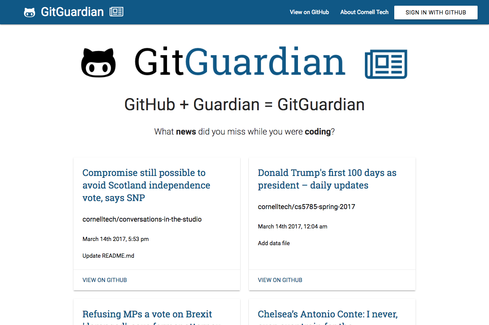

# cmtech-assignment-1

[](https://github.com/fvcproductions/cmtech-assignment-1/issues) [](https://github.com/fvcproductions/cmtech-assignment-1/pulls) [](http://badges.mit-license.org) [](http://paypal.me/fvcproductions)

GitHub API + Guardian API = GitGuardian

Login to GitHub and see what news you missed from the Guardian!



## Table of Contents

- [Installation](#installation)
- [Usage](#usage)
- [Contributing](#contributing)
- [Credits](#credits)

## Installation

Use the following command to serve up locally.

```shell
#
$ npm i -g firebase-tools # Install firebase-tools if you haven't already
$ firebase serve   # Start development server
```

CodeKit 3 was also used to serve up locally.

## Usage

1. Login using GitHub with oAuth possible from Firebase
2. Recent push commits from logged in user parsed using GitHub API and time stamps are fed into Guardian API
3. Guardian API parses time stamps and shows headline most closely matching time stamp of push commit

### Endpoints

- GitHub
    + GitHub commits
- Guardian
    + Guardian articles

### Struggles

- Even though user is able to login using GitHub, I wasn't able to figure out how to get commits from logged in user so app is just showing [@cornelltech](http://github.com/cornelltech) push commits/headlines.

## Contributing

> To get started...

- 🍴 Fork this repo [here](https://github.com/fvcproductions/cmtech-assignment-1#fork-destination-box)
- 🔨 Hack away
- 👥 Add yourself as a contributor under credits
- 🔧 Make a pull request [here](https://github.com/fvcproductions/cmtech-assignment-1/compare)
- 🎉 Get your pull request approved - success!

Or just [create an issue](https://github.com/fvcproductions/cmtech-assignment-1/issues) - any little bit of help counts! 😊

## Credits

- [FVCproductions](http://fvcproductions.com) 🍓🍫
- Mengjiao (Molly) Zhu
